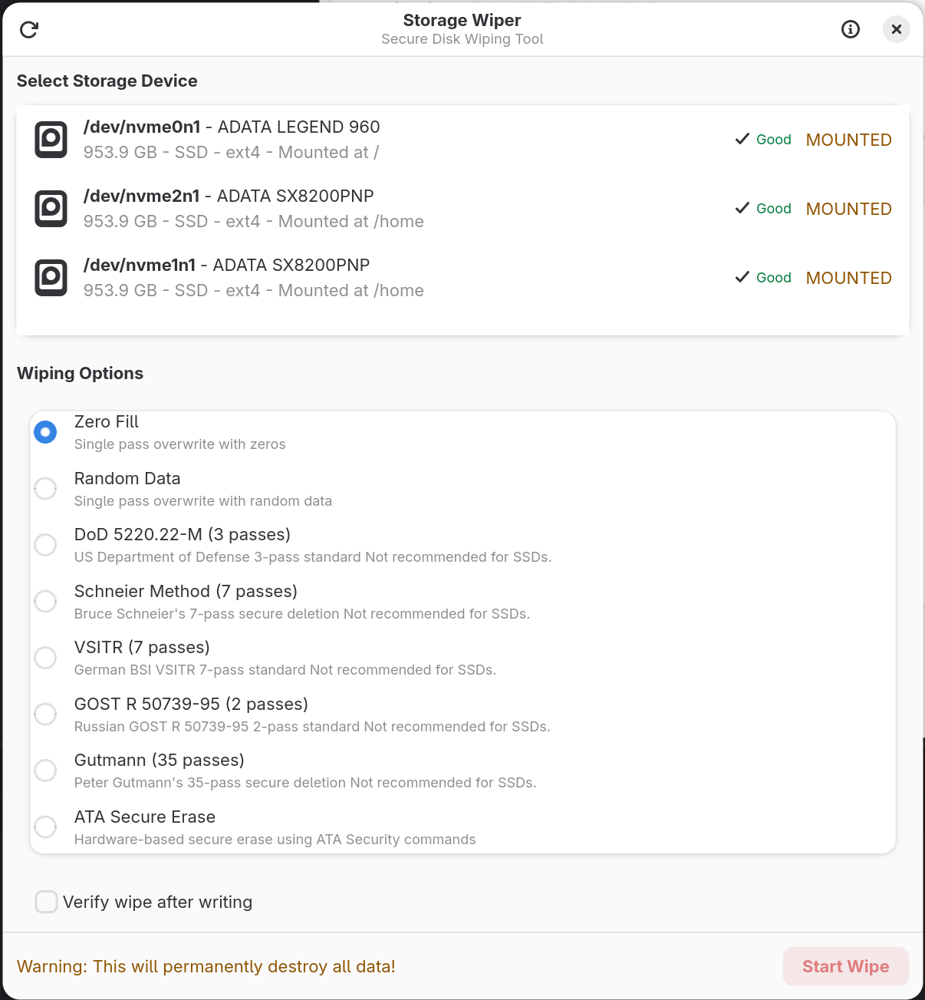

# Storage Wiper

A modern, secure disk wiping application built with GTK4 and libadwaita for Linux systems. Features multiple DoD-compliant wiping algorithms and a clean, intuitive interface.


## Features

- 🔒 **8 Secure Wiping Algorithms**
  - Zero Fill (1-pass)
  - Random Fill (1-pass)
  - DoD 5220.22-M (3-pass)
  - Bruce Schneier (7-pass)
  - VSITR German Standard (7-pass)
  - GOST R 50739-95 Russian Standard (2-pass)
  - Peter Gutmann (35-pass)
  - ATA Secure Erase (hardware-based, for SSDs)

- 💾 **Smart Disk Detection**
  - Automatic SSD vs HDD detection
  - NVMe drive support
  - Mount status warnings
  - LVM Physical Volume support (with logical volume exclusion)
  - Size and model information display

- 🎨 **Modern GTK4/Adwaita Interface**
  - Native GNOME integration
  - Adaptive and responsive design
  - Real-time progress reporting
  - Destructive action confirmations

- 🏗️ **Clean Architecture**
  - Model-View-ViewModel (MVVM) pattern
  - Dependency injection
  - Interface-based design
  - Modern C++23 codebase
  - D-Bus privilege separation

## Screenshots

[](docs/images/main.png)

*Storage Wiper showing disk selection with NVMe drives and wiping algorithm options*

## Requirements

### Runtime Dependencies
- GTK4 (≥ 4.0)
- gtkmm-4.0 (≥ 4.6)
- libadwaita-1 (≥ 1.0)
- Linux kernel with `/sys/block` support
- D-Bus system bus
- polkit (for privilege escalation)

### Build Dependencies
- Meson (≥ 0.59.0)
- Ninja build system
- g++ or clang++ with C++23 support
- pkg-config
- GTK4 development files
- gtkmm-4.0 development files
- libadwaita development files

### Optional (for development)
- [just](https://github.com/casey/just) (command runner - highly recommended)
- clang-tidy (static analysis)
- cppcheck (bug detection)
- entr (file watcher for auto-rebuild)

## Installation

### Arch Linux

```bash
# Install dependencies
sudo pacman -S gtk4 gtkmm-4.0 libadwaita meson ninja gcc pkgconf just

# Clone repository
git clone https://github.com/kidoz/storage-wiper.git
cd storage-wiper

# Build using just (recommended)
just build

# Or build with Meson directly
meson setup builddir
meson compile -C builddir

# Install (optional)
sudo meson install -C builddir
```

### Other Distributions

**Debian/Ubuntu:**
```bash
sudo apt install libgtk-4-dev libgtkmm-4.0-dev libadwaita-1-dev meson ninja-build g++ pkg-config
meson setup builddir
meson compile -C builddir
```

**Fedora:**
```bash
sudo dnf install gtk4-devel gtkmm4.0-devel libadwaita-devel meson ninja-build gcc-c++ pkgconfig
meson setup builddir
meson compile -C builddir
```

## Usage

⚠️ **WARNING**: This tool permanently destroys data. Use with extreme caution!

```bash
# Run with just (recommended)
just run

# Or run the application directly (D-Bus helper handles privileged operations)
./builddir/storage_wiper

# Run via pkexec (alternative authentication method)
just run-pkexec
```

**Note**: The application uses D-Bus with privilege separation. The GUI runs unprivileged, while the `storage-wiper-helper` daemon handles disk operations with appropriate permissions via polkit.

**Workflow:**
1. Select your target disk from the list
2. Choose a wiping algorithm
3. Confirm the destructive action
4. Monitor progress

### Development Commands

```bash
just              # Show all available commands
just build        # Build release
just build-debug  # Build debug
just run-inspect  # Run with GTK inspector
just watch        # Auto-rebuild on file changes (requires entr)
just lint         # Run clang-tidy
just cppcheck     # Run cppcheck
just format       # Format code with clang-format
just format-check # Check formatting (CI-friendly)

# Testing
just test         # Run all unit tests
just test-verbose # Run tests with detailed output
just test-filter "Pattern"  # Run specific tests

# Memory analysis
just valgrind     # Check for memory leaks
```

### Command-Line Options

Currently, Storage Wiper is a GUI-only application and does not support command-line options.

## LVM and Device-Mapper Handling

Storage Wiper uses a **hybrid approach** for LVM environments:

✅ **Shows physical disks** - Including disks that are LVM Physical Volumes (PVs)
- Examples: `/dev/sda`, `/dev/nvme0n1`
- These can be wiped to destroy LVM configurations

❌ **Hides logical volumes** - Device-mapper devices are excluded
- Examples: `/dev/mapper/vg-lv`, `/dev/dm-0`
- Use `lvremove`, `vgremove`, `pvremove` first

**Recommended workflow:**
```bash
# 1. Remove LVM structures
sudo lvremove /dev/vg_name/lv_name
sudo vgremove vg_name
sudo pvremove /dev/sda1

# 2. Wipe the physical disk
./storage_wiper
```

## Security Considerations

- ✅ D-Bus privilege separation (GUI runs unprivileged)
- ✅ Polkit-based privilege escalation
- ✅ Device path whitelist validation
- ✅ Mount status checking
- ✅ Destructive action confirmations
- ✅ Virtual device filtering (loop, ram, dm-)
- ✅ O_SYNC flag to bypass write caching
- ✅ Thread-safe operation cancellation

## Algorithm Comparison

| Algorithm         | Passes | Best For              | Speed   |
|-------------------|--------|-----------------------|---------|
| Zero Fill         | 1      | Quick wipe, SSDs      | ⚡⚡⚡ |
| Random Fill       | 1      | Basic security        | ⚡⚡⚡ |
| GOST R 50739-95   | 2      | Russian compliance    | ⚡⚡   |
| DoD 5220.22-M     | 3      | Government standard   | ⚡⚡   |
| Schneier          | 7      | High security         | ⚡     |
| VSITR             | 7      | German compliance     | ⚡     |
| Gutmann           | 35     | Maximum paranoia      | 🐌     |
| ATA Secure Erase  | N/A    | SSDs (hardware-based) | ⚡⚡⚡ |

**Note**: For modern SSDs, ATA Secure Erase or a single-pass wipe (Zero/Random) is generally sufficient due to wear-leveling and internal architecture.

## Development

### Building with Linters

```bash
# Enable clang-tidy
meson setup builddir -Denable_clang_tidy=true
meson compile -C builddir
meson compile -C builddir clang-tidy

# Enable cppcheck
meson setup builddir -Denable_cppcheck=true
meson compile -C builddir
meson compile -C builddir cppcheck

# Clean and reconfigure
rm -rf builddir
meson setup builddir
```

### Architecture

Storage Wiper follows the **MVVM (Model-View-ViewModel)** pattern with a privileged D-Bus helper:

- **View Layer**: GTK4/Adwaita UI (`MainWindow`, `DiskRow`, `AlgorithmRow`)
- **ViewModel Layer**: Business logic with observable properties (`MainViewModel`)
- **Model Layer**: D-Bus client services (`DBusClient`), helper services (`DiskService`, `WipeService`), and Algorithms

**D-Bus Architecture**: The GUI runs unprivileged while a separate `storage-wiper-helper` daemon handles privileged disk operations via D-Bus. This provides better security through privilege separation.

Key design patterns:
- Dependency Injection (custom DI container)
- Observable Pattern (automatic UI updates via `Observable<T>`)
- Command Pattern (UI actions via `Command`)
- Strategy Pattern (pluggable algorithms via `IWipeAlgorithm`)
- Factory Pattern (algorithm creation)
- RAII (resource management)

### Project Structure

The project uses a **unified layout** where headers and sources are kept together:

```
storage-wiper/
├── src/                  # All source and header files
│   ├── Application.hpp/cpp
│   ├── main.cpp
│   ├── algorithms/       # Wiping algorithms (IWipeAlgorithm implementations)
│   ├── core/             # Observable, Command infrastructure
│   ├── di/               # Dependency injection container
│   ├── helper/           # Privileged D-Bus helper daemon
│   ├── models/           # Data structures (DiskInfo, WipeTypes, ViewTypes)
│   ├── services/         # Service interfaces and D-Bus client (DBusClient)
│   ├── helper/services/  # Privileged disk services (DiskService, WipeService)
│   ├── util/             # Utility classes (FileDescriptor, Result)
│   ├── viewmodels/       # Business logic (MainViewModel)
│   └── views/            # GTK4/Adwaita UI widgets
├── tests/                # Unit tests (Google Test/Mock)
│   ├── mocks/            # Mock implementations
│   ├── fixtures/         # Test fixtures
│   └── unit/             # Unit test files
├── data/                 # Desktop integration files
├── packaging/            # Distribution packages (Arch Linux)
├── justfile              # Development commands
└── meson.build           # Build configuration
```

### Two Executables

1. **storage_wiper** - Main GUI application (runs unprivileged)
2. **storage-wiper-helper** - Privileged D-Bus helper for disk access (installed to libdir)

### Code Quality

The project uses modern C++23 features:
- `std::format` for string formatting
- `std::ranges` for algorithms
- `std::string_view` for efficiency
- Designated initializers
- `constexpr` and `noexcept`
- Smart pointers for memory safety

Static analysis available via:
- clang-tidy (CppCoreGuidelines, CERT, security)
- cppcheck (bugs, style, performance)

## Project Status

**Current Version**: 1.3.2

### Completed Features
- ✅ Core disk detection and enumeration
- ✅ SSD/HDD/NVMe detection
- ✅ 8 wiping algorithms implemented
- ✅ GTK4/Adwaita UI
- ✅ MVVM architecture with observable data binding
- ✅ Progress reporting with ETA and speed display
- ✅ Desktop notifications on completion
- ✅ Mount status checking
- ✅ LVM physical volume support
- ✅ Thread-safe cancellation
- ✅ Static analysis integration (clang-tidy, cppcheck)
- ✅ Code formatting with clang-format
- ✅ RAII-based resource management
- ✅ Exception-safe progress callbacks
- ✅ Desktop integration (polkit, .desktop file, icon, AppStream metainfo)
- ✅ Arch Linux packaging
- ✅ Comprehensive unit tests (~139 tests with Google Test/Mock)
- ✅ Memory leak checking with valgrind
- ✅ D-Bus privilege separation architecture
- ✅ D-Bus reconnection logic
- ✅ Systemd service file for D-Bus helper

### Planned Features
- [ ] Multi-disk parallel wiping
- [ ] Partition-level wiping (currently whole disks only)
- [ ] Wiping verification
- [ ] Command-line interface
- [ ] Wiping profiles/presets
- [ ] Detailed logging
- [ ] Bad sector handling
- [ ] SMART data display

### Known Limitations
- GUI only (no CLI yet)
- Whole disk wiping only (no partition support)
- No verification mode
- ATA Secure Erase requires hardware support and may not work on all drives
- D-Bus helper requires proper polkit configuration for privilege escalation

## Contributing

Contributions are welcome! This project is a defensive security tool, so please keep security as the top priority.

### Guidelines
1. Follow existing code style (see `.clang-tidy`)
2. Run linters before submitting (`./run-linters.sh`)
3. Test on real hardware carefully (use VMs when possible)
4. Add tests for new algorithms
5. Update documentation

### Security Policy
- Only defensive security features
- No credential harvesting
- Clear warnings for destructive actions
- Whitelist-based device validation

## License

This project is licensed under the MIT License - see the [LICENSE.md](LICENSE.md) file for details.

## Disclaimer

⚠️ **IMPORTANT**: This software permanently destroys data. The authors are not responsible for data loss, hardware damage, or any other consequences of using this software. Always verify you have selected the correct disk and have proper backups before wiping.

This is a defensive security tool intended for legitimate data sanitization purposes only.

## Acknowledgments

- GTK4 and libadwaita teams for the excellent UI framework
- C++ Core Guidelines authors (Bjarne Stroustrup, Herb Sutter)
- Algorithm authors: Peter Gutmann, Bruce Schneier, and standards bodies
- Open source community

## Support

- 🐛 **Bug Reports**: [GitHub Issues](https://github.com/kidoz/storage-wiper/issues)
- 💬 **Discussions**: [GitHub Discussions](https://github.com/kidoz/storage-wiper/discussions)
- 📧 **Security Issues**: Report privately via email

## See Also

- [justfile](justfile) - Development command runner
- [meson.build](meson.build) - Build system configuration
- [packaging/archlinux/](packaging/archlinux/) - Arch Linux packaging

---

**Made with ❤️ for secure data sanitization**

**Author**: Aleksandr Pavlov (<ckidoz@gmail.com>)
