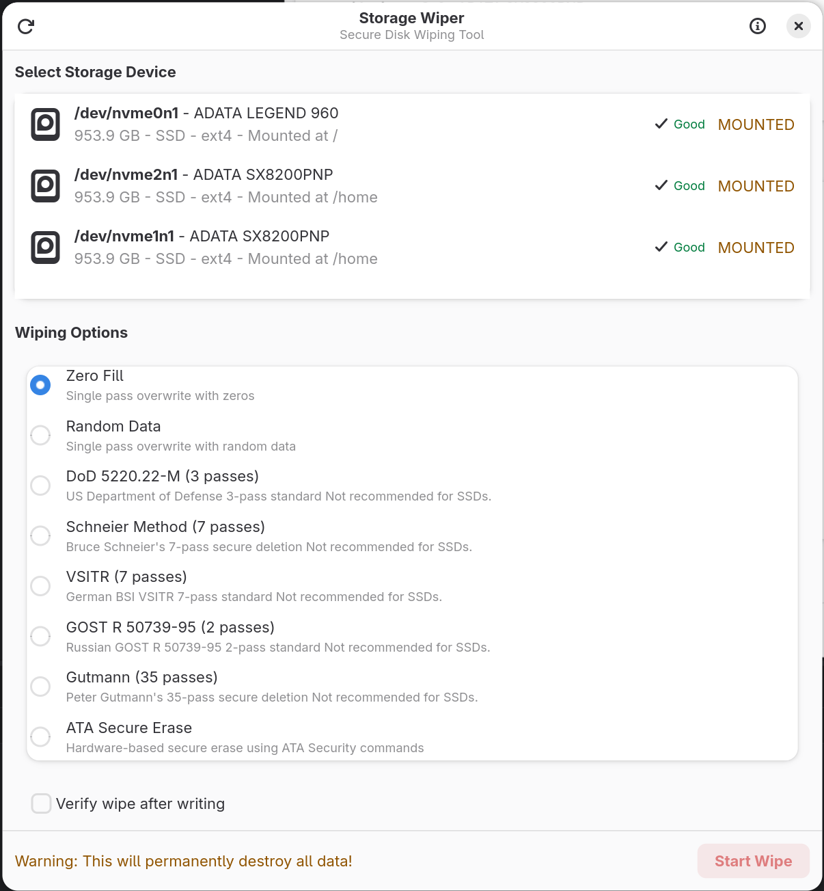

# Storage Wiper

Storage Wiper is a Linux application for erasing storage devices, with a
GTK4/libadwaita interface and a command-line client. Both clients run as a normal
user and communicate with a privileged helper over D-Bus; polkit authorizes
device operations.

**Wiping permanently destroys data.** Confirm the device identity and operation
scope before starting. Learn the application with the read-only tutorials first.

## Documentation

Start at the [documentation home](docs/README.md). The documentation follows
[Diátaxis](https://diataxis.fr/), with separate routes for learning, completing
tasks, looking up facts, and understanding the design.

| Your goal | Start here |
| --- | --- |
| Build the project and try its simulated tests | [Build and explore](docs/tutorials/build_and_explore.md) |
| Learn to inspect disks without wiping them | [Inspect devices](docs/tutorials/inspect_devices.md) |
| Install the application and helper | [Install](docs/how_to/install.md) |
| Erase a selected device | [Wipe a device](docs/how_to/wipe_device.md) |
| Look up CLI flags or algorithm support | [CLI](docs/reference/cli.md) · [Algorithms](docs/reference/algorithms.md) |
| Understand privilege separation and wipe scope | [Architecture](docs/explanation/architecture.md) · [Device scope](docs/explanation/device_scope.md) |

## Features

- Eight algorithms: Zero Fill, Random Fill, DoD 5220.22-M, Gutmann, Schneier,
  VSITR, GOST R 50739-95, and hardware secure erase.
- ATA Security Erase and NVMe Sanitize, with cryptographic Format NVM as an
  NVMe fallback when supported.
- Whole-disk and partition selection, mount checks, and explicit scope
  confirmation. Hardware erase requires a whole disk and can affect every NVMe
  namespace on a controller.
- Concurrent wipes on independent devices, with progress and cancellation
  tracked per device.
- Optional readback verification for Zero Fill, Random Fill, and DoD.
- SMART health information for supported ATA, SCSI/SAT, NVMe, and eMMC devices.
- Bad-sector reporting and discard after successful SSD wipes, following
  verification when enabled.
- JSON and text wipe certificates, generated automatically by the GUI and on
  request by the CLI.
- JSON device listings for scripts and saved GUI algorithm/verification
  preferences.

The application's Clear/Purge labels describe its algorithm categories. They
are not an independent certification of a particular device or sanitization
procedure; see [sanitization and verification](docs/explanation/sanitization.md).

## Screenshot

## Development

The project uses C++23, Meson, Google Test/Mock, and a Model-View-ViewModel
architecture. It builds three executables: `storage_wiper`,
`storage-wiper-cli`, and `storage-wiper-helper`.

- [Build requirements and options](docs/reference/build.md)
- [Run tests and quality checks](docs/how_to/run_checks.md)
- [Build Arch Linux packages](docs/how_to/package_archlinux.md)
- [Write documentation](docs/how_to/write_documentation.md)

HPA/DCO hidden-area detection and named wiping profiles are planned. Current
scope and hardware limitations are documented in
[device scope](docs/explanation/device_scope.md).

## Contributing and support

Keep changes focused, follow the surrounding code style, and add regression
coverage for behavior changes. Run the relevant checks and update documentation
when commands or behavior change.

- [Bug reports](https://github.com/kidoz/storage-wiper/issues)
- [Discussions](https://github.com/kidoz/storage-wiper/discussions)
- Security reports: contact Aleksandr Pavlov privately at <ckidoz@gmail.com>.

Storage Wiper is licensed under the [MIT License](LICENSE.md).

Thanks to the GTK4/libadwaita teams, the algorithm authors, and the contributors
who maintain the project.
