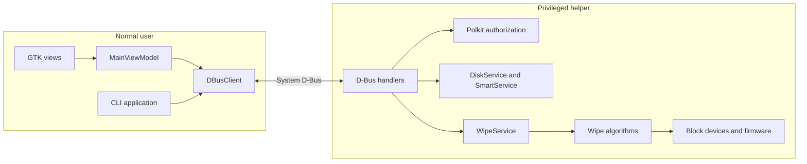

# Architecture

Storage Wiper separates user interaction from root device access. The GUI uses
Model-View-ViewModel (MVVM) to keep GTK widgets separate from operation state;
the CLI shares the same D-Bus client and helper contracts.

## The privilege boundary

Clients request operations through service interfaces. They do not gain root
privileges themselves. The helper checks the caller's polkit authorization,
validates canonical device paths, checks current eligibility, and performs the
device operation.

This boundary keeps authorization and device enforcement in the process that
actually opens disks. GUI confirmation helps the user choose deliberately;
it does not replace helper-side checks for a client that calls D-Bus directly.
The [D-Bus reference](../reference/dbus.md) describes each method and its
authorization action.

## MVVM and composition

[Application](../../src/Application.cpp) is the GUI composition root. It wires
the dependency-injection container, ViewModel, views, settings, and certificate
directory. [DBusClient](../../src/services/DBusClient.hpp) implements both
`IDiskService` and `IWipeService` for the unprivileged clients.

| Layer | Responsibility | Main code |
| --- | --- | --- |
| Views | Widgets, presentation, bindings, and user actions | [views](../../src/views/) |
| ViewModel | Selection, commands, confirmation flow, and per-device operation state | [MainViewModel](../../src/viewmodels/MainViewModel.cpp) |
| Models | Disk, health, algorithm, and progress data | [models](../../src/models/) |
| Service interfaces/client | Device-operation contracts and IPC | [services](../../src/services/) |
| Helper services | Enumeration, SMART, device claims, worker lifecycle | [helper/services](../../src/helper/services/) |
| Algorithms | Pass patterns, firmware execution, and verification | [algorithms](../../src/algorithms/) |
| Infrastructure | Observable properties, commands, DI, RAII, logging | [core](../../src/core/), [di](../../src/di/), [util](../../src/util/) |

Observable properties communicate state to views, and relay commands express
user actions with their availability. Service interfaces let ViewModel tests
substitute mocks without loading GTK widgets or opening devices.

Asynchronous ViewModel work uses weak references and marshals updates to the
main context. Views own their subscriptions and release them at destruction.
This matters because a service result can arrive after a window closes.

## A wipe's lifecycle

1. The client identifies the target, presents its scope, and sends the selected
   algorithm and verification request.
2. The helper authorizes the caller and validates the path and current mount
   state. Hardware erase also checks its wider affected scope.
3. `WipeService` reserves the operation and claims the device with exclusive
   access. Overlapping operations are rejected.
4. A worker executes the algorithm, reports progress, and observes its
   cancellation flag. Software writes use synchronous device I/O.
5. Supported verification runs when requested. Successful non-rotational
   software wipes can then issue discard; unsupported discard is skipped.
6. Terminal progress reaches the client, which updates its state and writes a
   certificate when configured.

Each helper operation owns its worker and cancellation state. Independent
devices can run in parallel. Finished helper workers are joined rather than
detached, and exclusive claims remain held across the whole operation,
including hardware erase. The scope rules are explained in
[device scope](device_scope.md).

Disk enumeration comes from sysfs and mount information. SMART data uses
device-specific interfaces, with caching to avoid repeating expensive queries
on each UI refresh. Partitions inherit their parent's identity and health
record while keeping their own path, size, and mount state.

## Helper activation

The repository ships two launch mechanisms:

- The [D-Bus activation template](../../data/dbus/su.kidoz.storage_wiper.Helper.service.in)
  specifies `Name`, `Exec`, and `User=root`. A request can launch the helper
  directly through this activation path.
- The [systemd unit](../../data/dbus/storage-wiper-helper.service.in) owns the
  same bus name with `Type=dbus`, adds filesystem/device restrictions, manages
  a writable log directory, and sends console output to the journal.

The activation template does not currently contain `SystemdService=`, so an
automatically D-Bus-activated helper does not necessarily run in the provided
unit's sandbox. Starting the unit explicitly before a client connects selects
the systemd path. Only one process can own the helper bus name.

See [install](../how_to/install.md) for setup and
[package upgrades](../how_to/package_archlinux.md#activate-an-upgraded-helper)
for changing the running helper after operations finish.

## Testing across the boundary

The project uses three complementary forms of testing:

- Unit tests exercise real algorithm code on temporary files and pipes, and use
  service mocks for ViewModel behavior.
- Simulated device-I/O tests run real service and algorithm code with wrapped
  system calls. The fake layer refuses unregistered `/dev/` paths.
- D-Bus client tests communicate over a private bus, checking actual variant
  encoding, decoding, and asynchronous callbacks.

The helper and client share signature constants with compile-time field-count
checks, reducing the risk that a type mismatch becomes an empty result at
runtime. Tests also guard the published XML contract. See
[run checks](../how_to/run_checks.md).

## Current boundary limitations

Progress signals are broadcast on the system bus, so operation paths and timing
are not private to the initiating user. Interactive polkit checks currently
wait on the helper's main loop; a pending authentication dialog can delay signal
delivery even while worker I/O continues. These are characteristics to account
for when integrating a client or deploying the helper.

[Explanation](README.md) · [Documentation home](../README.md)
